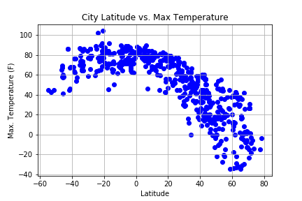
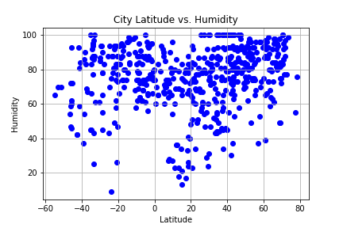
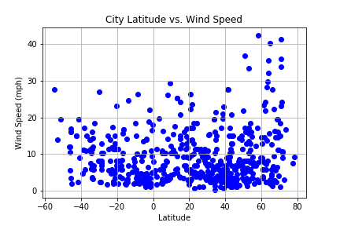
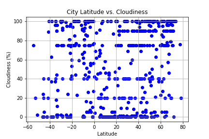

# 06-Python-API-Homework
# Python API Homework - What's the Weather Like?

## Background

Whether financial, political, or social -- data's true power lies in its ability to answer questions definitively. So let's take what you've learned about Python requests, APIs, and JSON traversals to answer a fundamental question: "What's the weather like as we approach the equator?"

Now, we know what you may be thinking: _"Duh. It gets hotter..."_

But, if pressed, how would you **prove** it?

In this example, I'll be creating a Python script to visualize the weather of 500+ cities across the world of varying distance from the equator. To accomplish this, I'll be utilizing a [simple Python library](https://pypi.python.org/pypi/citipy), the [OpenWeatherMap API](https://openweathermap.org/api), and a little common sense to create a representative model of weather across world cities.

The objective is to build a series of scatter plots to showcase the following relationships:

* Temperature (F) vs. Latitude
* Humidity (%) vs. Latitude
* Cloudiness (%) vs. Latitude
* Wind Speed (mph) vs. Latitude

##File to use:
GRADE_THIS/WeatherPy.ipynb

## Findings:

When you compare the temperature and the latitude.  Temperatures are similar around the equator as well if you go up or down from it.  However, the farther up the equator the colder the temperature.

The majority of the cities have high humidity.  But there is little correlation between where a city is located and humidity. 

The same is true for windspeed.  Although the majority of cities have low wind speeds, there is little correlation.

With regards to cloudiness, there was no real correlation with where the city was located.

